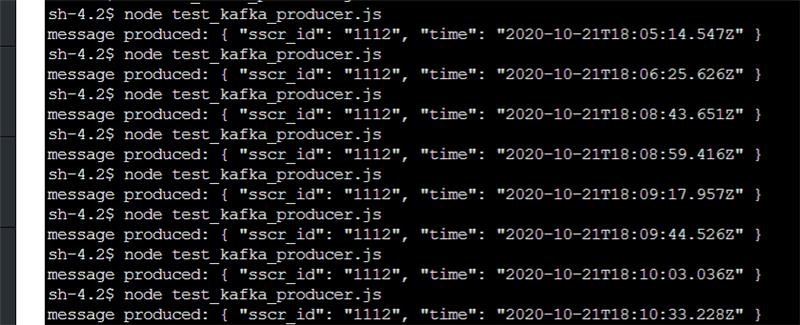
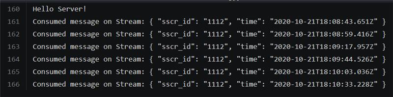
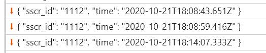

## Install and run

```bash
cp .env.example .env
```

Add to `.env` your login and password for cloudkarafka.com.

```bash
cd server
./docker_build.sh
./docker_run.sh
```

```bash
cd client
npm i
npm start
```

## Produce message

```
cd server
./docker_exec.sh
node test_kafka_producer.js
```

You can also produce and consume messages when you login to cloudkarafka.com and go to BROWSER.

To get topic, go to TOPICS.

## Screenshots showing that not all messages are received by web browser

Here I am producing multiple messages:



Nodejs receive them all:



Not all messages sent from nodejs are recevied by google chrome:



And not even one is received by Internet Explorer 11.